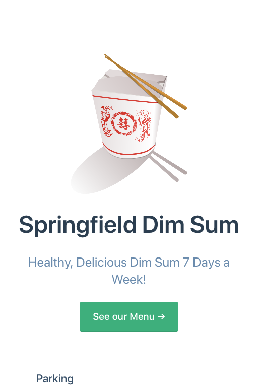

# Adding a site title

The simplest addition to [config.js](./config1.md) is the `title` attribute. 
You do it by adding a [YAML](/yaml/adding-yaml.md) `title` attribute to the
home page.

First, let's take a look at a simple site with no `config.js` at all:



<!-- The README.md for such a site would insert [YAML front matter](/yaml/adding-yaml.md) like this:
-->
The README.md for such a site would insert [YAML front matter](/yaml/adding-yaml.md) like this:

###### file README.md
```yaml
---
home: true 
heroText: Springfield Dim Sum
heroImage: /img/springfield-dim-sum-800px.png
tagline: Healthy, Delicious Dim Sum 7 Days a Week!
actionText: See our Menu →
actionLink: ./menu.md
features:
- title: Parking
  details: Plenty of free parking at night and free validation during the busin
---
```

* Now create the file `/.vuepress/config.js` with the following contents:

###### file /.vuepress/config.js
```javascript
module.exports = {
    title: "Dim Sum!"
}
```

In a moment you'll see a change:


## What the site title does

The site title is added to all pages and, in the default theme, is added to the top navbar.

#### Reference

See the VuePress [title](https://vuepress.vuejs.org/config/#title) documenation.


