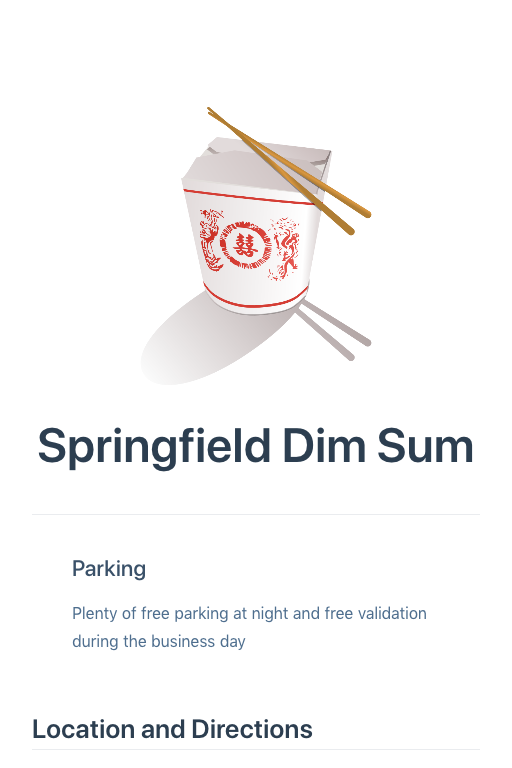
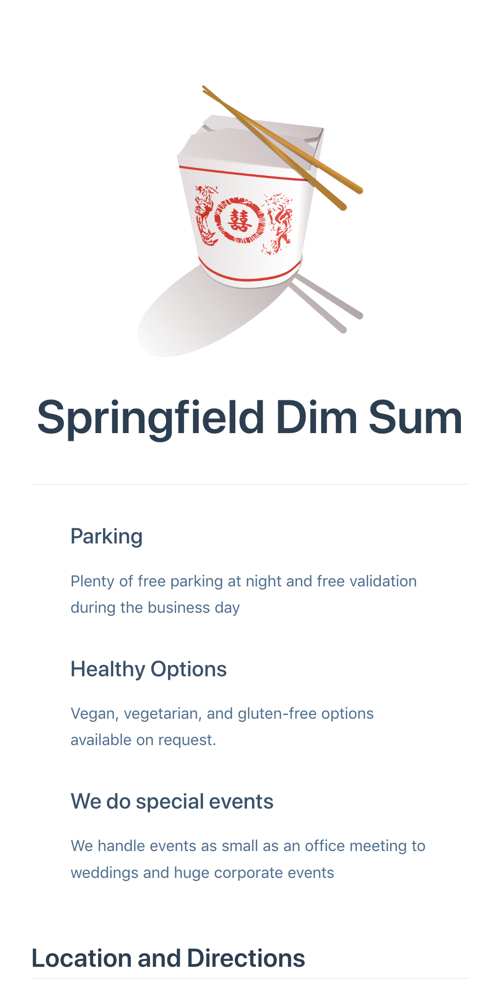
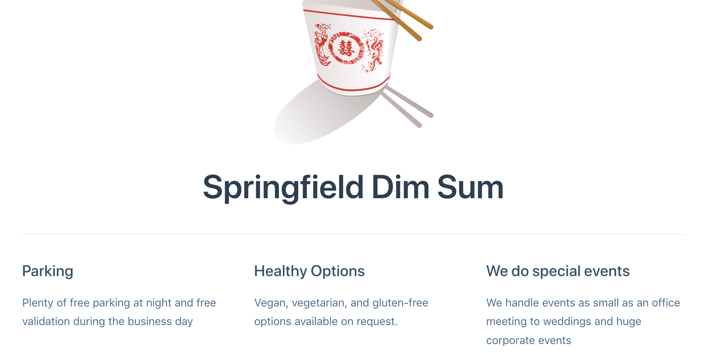

# Adding "features" YAML markup to the home page

The VuePress default theme has markup that displays a headline-like feature, and a smaller
headline-like text explanation. It's all meant to advertise features of your
product. These are added using YAML markup called `features` that, again,
is unique to the VuePress default theme.

Here it is isolated:

```yaml
features:
- title: Parking 
  details: Plenty of free parking at night and free validation during the business day
```

* Update your README.md file to look like this, with that
addition in context:

```yaml
---
home: true
heroText: Springfield Dim Sum
heroImage: heroImage: /img/springfield-dim-sum-800px.png
features:
- title: Parking 
  details: Plenty of free parking at night and free validation during the business day
---

## Location and Directions
  
```

When you update README.md and save it, you'll see this:



Now add a couple more and you'll see they're formatted responsively:

```yaml
---
home: true
heroText: Springfield Dim Sum
heroImage: heroImage: /img/springfield-dim-sum-800px.png
features:
- title: Parking 
  details: Plenty of free parking at night and free validation during the business day
- title: Healthy Options 
  details: Vegan, vegetarian, and gluten-free options available on request.
- title: We do special events 
  details: We handle events as small as an office meeting to weddings and huge corporate events 
---

## Location and Directions
  
```

As soon as you save you'll see this:



And with a responsive horizontal view:




