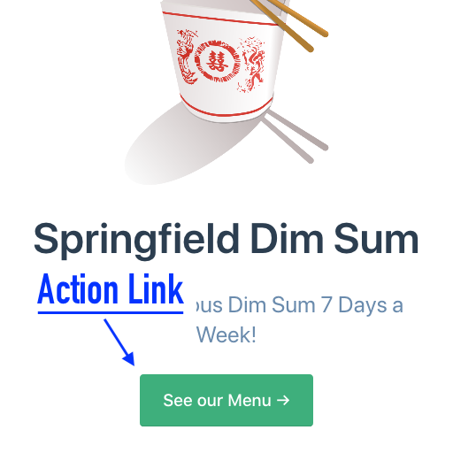

# Adding an action link to the home page with YAML

The Vuepress default theme features an optional big button that acts as a link.
It's called an "action link" and is made up of two pieces of YAML markup: `actionText`, 
which is the label text, and `actionLink`, which is the button's destination.



The YAML for this is:

```yaml
actionText: See our Menu →
actionLink: ./menu.md
```

Here it is in context:

---
home: true
heroText: Springfield Dim Sum
heroImage: /img/springfield-dim-sum-800px.png
tagline: Healthy, Delicious Dim Sum 7 Days a Week!
actionText: See our Menu →
actionLink: ./menu.md
---
## Location and Directions

* Add the above YAML to your README.md home page for these results:


