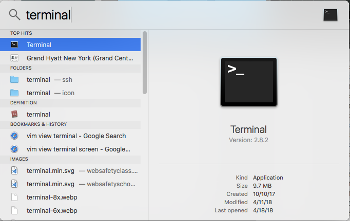

# Vuepress default theme tutorial: creating your home page

This is a step-by-step guide to creating a simple site
using the VuePress default theme. It's for an imaginary
restaurant named Springfield Dim Sum.

## Workflow

After you've installed [Node.js](https://nodejs.org) and [VuePress](https://vuepress.vuejs.org/guide/getting-started.html)
the typical workflow for creating a site is:

* Create a working directory and change to it
* Write markup files (text files with names ending in `.md` following a simple formatting convention
called [markdown](https://en.wikipedia.org/wiki/Markdown)), with the home page always named `README.md`,
and save them in the working directory
* Open a terminal window and run `vuepress dev` on the command line. This generates a website from
your VuePress source files, which include at a minimum `README.md`, and runs a webserver on your computer
* Open a browser window to [http://localhost:8080/](http://localhost:8080/) to see the live site
* Make changes to your markdown files or create new ones. 
VuePress sees they've been created and 
automatically generates new output each time you save a file

### Opening a terminal

You'll need to drop into your operating system's command line to use VuePress. 
First open a terminal.

### Opening a terminal on MacOS

The quickest way to find the terminal program on MacOS is this way:

* Choose the Spotlight icon, normally at the top of the screen
* Search for the word `terminal` and you'll see something like this in the results. Highlight the Terminal icon:



### Creating a Terminal shortcut on the MacOS dock (one time only)

You'll be using the Terminal a lot, so make a shortcut for it. You only need to
do this once.

* Under `Top Hits`, Drag the Terminal icon to the bottom of your screen, into the Dock.


Now you'll be able to start the terminal much faster next time.

### Opening the Windows command prompt

The quickest way to start the Windows command prompt is this:

* Press the Windows and R keys at the same time to bring up the Run dialog.


* Type `cmd` and press Enter.

The command prompt appears.


### Creating the directories for your VuePress site, MacOS version

Go to your normal work area, create the working directory, and move to it. 

In this case you would replace `~/code/` with wherever you choose to put your VuePress files. This site’s directory is creatively called `demo1`. It's also good to create subdirectories
for image and style sheet assets.

* Create the working directory and a subdirectory under it named `.vuepress` (don't forget that it starts with the period character). You can create them all at once like this:

```bash
# Create full directory path, including the
# necessary hidden directory .vuepress and
# a directory for public assets
$ mkdir -p ~/code/demo1/.vuepress/public
```

* And directories for assets such as images and style sheets. They can go anywhere; Vuepress imposes no convention for directories.

```bash
# Create directories for images and CSS.
$ mkdir -p ~/code/demo1/assets/img
$ mkdir -p ~/code/demo1/assets/css
```

::: tip
Always create the .vuepress sudirectory. It's not used at the moment but will be. All
VuePress sites other than the tiniest demos require it.
:::
* Now change to that directory. You will run `vuepress dev` or `vuepress build` from within it.

```bash
# Make it the working directory.
$ cd ~/code/demo1
```

### Creating the directories for your VuePress site, Windows version

Go to your normal work area, create the working directory, and move to it. 

In this case you would replace `%HOMEDIR%/code/` with wherever you choose to put your VuePress files. This site’s directory is creatively called `demo1`. It's also good to create subdirectories
for image and style sheet assets.

* Create the working directory and a subdirectory under it named `.vuepress` (don't forget that it starts with the period character). You can create them all at once like this:

```batch
:: Create full directory path, including the
:: necessary directory .vuepress and
:: a directory for public assets
> md %HOMEDRIVE%%HOMEPATH%\code\demo1\.vuepress\public
```

* And directories for assets such as images and style sheets. They can go anywhere; Vuepress imposes no convention for directories.

```batch
:: Create directories for images and CSS.
> md %HOMEDRIVE%%HOMEPATH%\code\demo1\assets\img
> md %HOMEDRIVE%%HOMEPATH%\code\demo1\assets\css
```

::: tip
Always create the .vuepress sudirectory. It's not used at the moment but will be. All
VuePress sites other than the tiniest demos require it.
:::
* Now change to that directory. You will run `vuepress dev` or `vuepress build` from within it.

```batch
:: Make it the working directory.
> cd %HOMEDRIVE%%HOMEPATH%\code\demo1
```

## Creating a minimal home page

A VuePress site is a directory containing at least a file named 'README.md' in Markdown form with at *least one header.* 
Open your favorite text editor (not Apple Pages or Microsoft, because they add
formatting that won't convert properly).

* Create a text file named `README.md` with the following contents:

```
# Wecome to Example.com 

We hope you love this tiny tiny site.
```


## Running vuepress dev

`README.md` is all you need to create a minimal VuePress site. Let's take a look at your progress so far. Run `vuepress dev` on your command line:

```bash
$ vuepress dev
```

If all goes well you'll see output like this:

```
  VuePress dev server listening at http://localhost:8080/

  [13:55:39] ✔ successfully compiled.
```

Running `vuepress dev` creates a sort of temporary copy of the site on the fly. It converts the Markdown files (such as README.md) to HTML, so, for example, `## Location and directions` gets converted to HTML that looks like this:

```html
<h1 id="welome-to-example-com">Welcome to Example.com</h1> 
```

While `vuepress dev` is running, you can make changes to your Markdown files 
and the changes will be reflected dynamically the moment you save.

## Opening a browser window to localhost:8080

Note the web address, which looks something like `http://localhost:8080/`. 

* Switch to a browser and browse to that address. 

Here's what you'll see:


## Taking a look at special VuePress default theme features

Although this is nominally a bare theme, 
you can already see it has a few advantages over a normal, blank HTML page. 
It has an attractive set of defaults for font, margins, and so on, 
and these will be uniform over all reasonably modern browsers. 
And there's something else that works great for technical documentation.

### Default theme feature: Active anchor for each header

Move your mouse or touch over the headline and you'll see a pound sign appear.


That represents a link to this exact location on the page (called an anchor, corresponding to an
anchor tag in HTML). If you right-click it and choose to copy the link from the context menu, 
when you paste in that link it will be pasted as `http://localhost:8080/http://localhost:8080/index.html#welcome-to-example-com`, 
not just `http://localhost:8080`.

Any good website used for reference purposes should use descriptive anchors like this. Vuepress
generates them automatically. 

### Page title is named after the first header in the markup file

You can see that VuePress automatically titles pages by reading the first header from each file. 

## VuePress comes with powerful headder-based search

Explore these new features. For example, click the search icon and type something, 
for example, `L` for lunch.


For the purposes of this demo, we created these minimal files and placed
them in the project's root directory:

###### file lunch.md

```
# Lunch menu
```

###### file dinner.md

```
# Dinner menu
```

## Adding title automates navigation

* Choose the `Lunch menu` item to see that page:


Note how the VuePress default them has built links to the dinner menu and the home page.

* Choose the `Dinner menu` item.


Now you see links to the the home page and the lunch menu.


