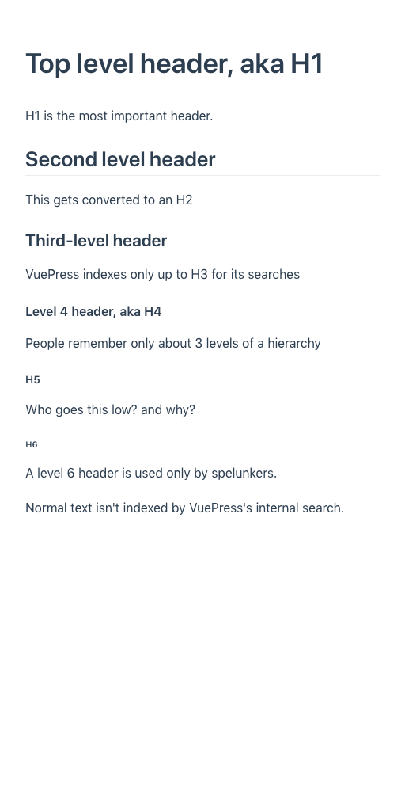

# Create and link to more pages 


All VuePress sites have at least one directory containing a `README.md` text file
formatted using Markdown. That directory may contain other Markdown files with the 
`.md` extension. 

Start with a simple `README.md`:

```markdown
# Welcome to to Example.com

We hope you love this tiny tiny site.

Need to [contact someone](./contact.md) on the team?
```

## Special properties of README.md

Markdown files get converted into HTML files by the same name, but with an `.html` extension.
`README.md` is an exception. It gets renamed completely, to `index.html`, because by convention that's
how web servers normally find the root file of a website.

The root `README.md` file must start with a header. It doesn't have to be an H1 (`#` as shown above) but it should
be either H2  (`##`) or H3  (`###`) for proper generation of search indexes and sidebars.

Another property of `README.md` as mentioned before is that if you want to organize
your site using subdirectories, a subdirectory is invisible to VuePress unless it has a `README.md` 
in it. Those `README.md` files can be blank.

Lines with no special treatment get converted into standard HTML paragraph tags.

## Creating headers 

Lines starting with `#` get converted to HTML H1 headers, lines starting with `##` become H2 headers, and so on.
Organize your site carefully using headers because levels H1-H3 are indexed automatically by VuePress
for its blazingly fast search dialog.
Putting words most relevant to your audience into headers also helps in search engine results.

```markdown
# Top level header, aka H1

H1 is the most important header.

## Second level header

This gets converted to an H2

### Third-level header

VuePress indexes only up to H3 for its searches

#### Level 4 header, aka H4

People remember only about 3 levels of a hierarchy

##### H5

Who goes this low? and why?

###### H6

A level 6 header is used only by spelunkers.

Normal text isn't indexed by VuePress's internal search.

```

And the result is pretty much what you'd expect:



## Creating links

Markdown such as ` [contact someone](./contact.md)` gets turned into an HTML link. The part 
of the link in square brackets, `contact someone` in this case, becomes the anchor text (the
visible part of a link, and the part that gets indexed by search engines). The part in 
parentheses, `./contact.md` in this case, gets becomes a reference to an HTML file by the same 
name, which would be `contact.html` in the current directory.

### Linking to external web sites using Markdown

The format for linking to other websites is similar to Markdown but you just
use the website's actual URL in parentheses. For example:

```markdown
Try [Google](https://www.google.com/) for more info.
```

### Linking to headers inside a file 

VuePress secretly turns every header into its own named file location.
This lets you navigate not just to a file, but to any header
in that file. You do it by following the filename with the header,
where spaces have been removed and punctuation is replaced with
spaces. For example, `contact.md#rosie-greer`. Here's a 
complete illustration.

Take the following file named `contact.md`:

```markdown
# Contact

Here's whom to call when you have a problem.

## Tyler Perry

He has two first names! How cool is that?

## Rosie Greer

When two heads are better than one.
```

Suppose you want to link right to Rosie, not just to the Contact page itself?

Let's try linking to Rosie's location inside `contact.md` in a slightly modified `README.md`:

```markdown
# Welcome to to Example.com

## This just in!

Good news! [Rosie's](./contact.md#rosie-greer)
head graft is a major success!

Let's face it. You're darn lucky to be here.

Need to [contact someone](./contact.md) on the team?
```

As you can see, the anchor to a header such as `## Rosie Greer` flattened out. 
Everything gets converted to lower case, and spaces are replaced with hypens.
This location name is synthesized as `#rosie-greer`:

```
Good news! [Rosie's](./contact.md#rosie-greer)
head graft is a major success!
```

If you click Rosie's name you'll
be taken directly to that position in the file.

<!--
```
┌── README.md
├── about.md
├── chapter1.md
├── chapter2.md
└── .vuepress/
```

If you have sections consisting of more than one file, it's very 
useful to put them in subdirectories. Each subdirectory must
contain a `README.md` of its own. 
 
```
┌── README.md
├── chapter1.md
├── chapter2.md
└── chapter3/
        ├── README.md
        ├── article1.md
        └── article2.md
```

## Change home page behavior with YAML

### Obtain a hero image

* Obtain an image file for the main home page image (called the hero image). In this example
it's called logo.png but the name and size don't matter. 

It helps to get one with
a transparent or white background if you're using the default VuePress theme
with no changes.

## Add special YAML instructions for the home README.md

The root `README.md` page can be customized extensively by adding 
special configuration text in YAML format.

The parts in between `---` lines are called [YAML](../yaml/adding-yaml.md). They do not display directly but
they contain site settings. The site's content appears after the second `---`, so in this case it's
a level 2 header that says `Secondary title-less important thatn heroText`.

```yaml
---
# Specify this is the home page 
# (and therefore uses the Home.vue template)
home: true
# Put a big centered H1 in the middle of the page
heroText: Main title of your site

# Image for the center of the home page
heroImage: /logo.png

# Explain what the site is all about
tagline: Catchy description of site

# Text for the big green button:
actionText: See our Menu →

# Page big green button should link to. 
actionLink: ./menu.md
---
## Secondary title-less important thtn heroText

And regular text goes here.
```

## Add a title, mobile menu, and search

The site's global title, search capability for header levels 1-3, and mobile
"hamburger" menu are added with `title` and `description` attributes of `config.js`.

* Create the file `/.vuepress/config.js` with contents along these lines. Windows users 
should replace forward slashes with backslashes in the preceding example directory.

```javascript
module.exports = {
  title: "Springfield Dim Sum",
  description: "Springfield's best Chinese food!"
}
```
-->

